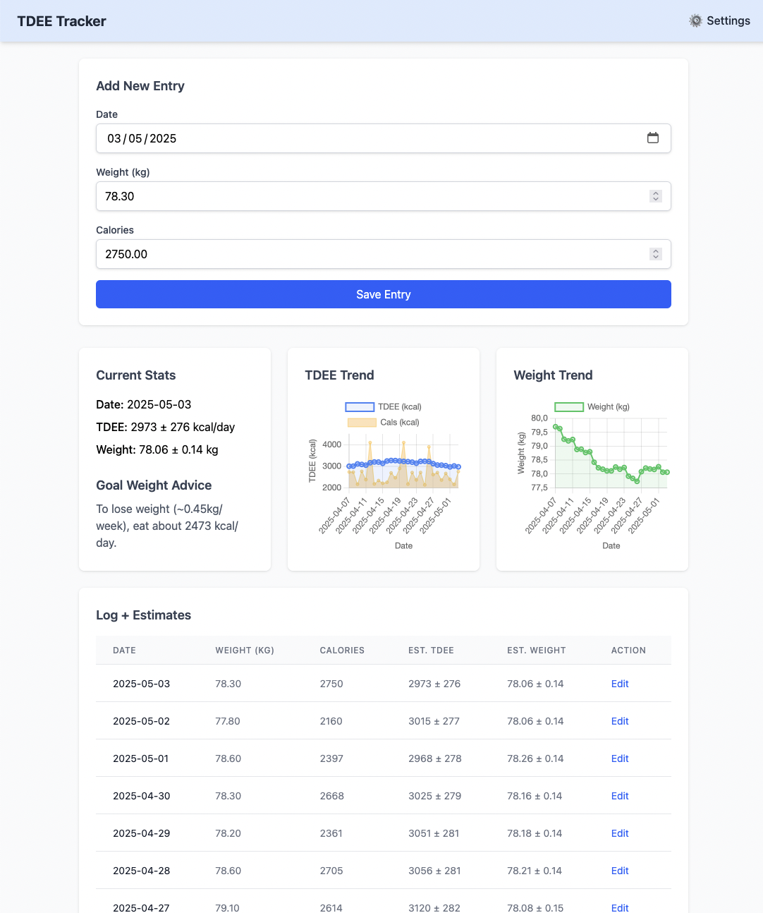

# TDEE Tracker UI

[](https://goreportcard.com/report/github.com/francescoalemanno/TDEE-Tracker-UI)
[](https://opensource.org/licenses/MIT)

A modern, easy-to-use web application for tracking your Total Daily Energy Expenditure (TDEE) and managing weight goals.

## 📋 Overview

TDEE Tracker UI helps you:

- Log your daily weight and caloric intake
- Track your TDEE (how many calories your body burns) using advanced statistical methods
- Visualize weight and TDEE trends over time
- Receive personalized advice for reaching your weight goals

This tool is perfect for fitness enthusiasts, dieters, or anyone interested in understanding their metabolism better.

## 🌟 Features

- **Simple Daily Logging**: Easy interface to enter your weight and calorie intake
- **Smart Calculations**: Uses particle filtering to accurately estimate your TDEE
- **Visual Trends**: See how your TDEE and weight change over time with intuitive charts
- **Goal Setting**: Enter your target weight and get daily calorie recommendations
- **Customizable Parameters**: Adjust calculation settings based on your specific needs
- **Local Storage**: Your data stays on your computer, no cloud account needed
- **Responsive Design**: Works well on both desktop and mobile devices

## 🖥️ Screenshots


## 🚀 Getting Started

### Installation Options

#### 1. Download Pre-built Binary (Easiest)

Download the latest release for your operating system from the [Releases page](https://github.com/francescoalemanno/TDEE-Tracker-UI/releases).

#### 2. Build from Source

If you have Go installed, you can build from source:

```bash
# Clone the repository
git clone https://github.com/francescoalemanno/TDEE-Tracker-UI.git
cd TDEE-Tracker-UI

# Build the application
go build .

# Run the application
./TDEE-Tracker-UI  # on Linux/macOS
TDEE-Tracker-UI.exe  # on Windows
```

### First Time Setup

1. Launch the application - it will automatically open in your default web browser
2. Go to the Settings page (⚙️ icon) to set your goal weight
3. Start logging your daily weight and calories consumed

## 📊 How It Works

TDEE Tracker uses a particle filter algorithm to estimate your true TDEE based on your logged weight and calorie intake. The mathematical model accounts for:

- Daily metabolic variations
- Measurement errors in calorie counting
- Fluctuations in body weight measurements
- The relationship between calorie deficit/surplus and weight change

For optimal results:

- Log your weight and calories consistently (daily is best)
- Be as accurate as possible with calorie counting
- Give the model at least 2-3 weeks of data for accurate TDEE estimation

## ⚙️ Configuration

In the Settings page, you can customize:

| Parameter | Description | Default |
|-----------|-------------|---------|
| Initial TDEE | Starting estimate for your TDEE | -1 (uses first entry's calories) |
| Calories per Fat Kg | Energy stored in 1kg of body fat | 7700 kcal/kg |
| RSD TDEE | Day-to-day variation in metabolism | 0.01 |
| RSD Obs Cal | Accuracy of calorie counting | 0.1 |
| RSD Obs Weight | Accuracy of weight measurement | 0.004 |
| RSD Weight Drift | Random daily variation in true weight | 0.0001 |
| PF Variance Boost | Particle filter variance scaling | 0.0833 |
| Goal Weight | Your target weight in kg | -1 (disabled) |

## 📁 Data Storage

Your data is stored in the following locations:

- **Windows**: `%USERPROFILE%\.config\tdee-tracker\`
- **macOS**: `$HOME/.config/tdee-tracker/`
- **Linux**: `$HOME/.config/tdee-tracker/`

You can override the storage location using environment variables:
- `TDEE_LOGS_FILE`: Path to the CSV file for your logs
- `TDEE_PARAMS_FILE`: Path to the JSON file for your settings

## 🤝 Contributing

Contributions are welcome! Please feel free to submit a Pull Request.

1. Fork the repository
2. Create your feature branch (`git checkout -b feature/amazing-feature`)
3. Commit your changes (`git commit -m 'Add some amazing feature'`)
4. Push to the branch (`git push origin feature/amazing-feature`)
5. Open a Pull Request

## 📜 License

This project is licensed under the MIT License - see the [LICENSE](LICENSE) file for details.

## 🙏 Acknowledgements

- The TDEE estimation algorithm is based on principles of Bayesian statistics and particle filtering
- UI designed with Tailwind CSS for a clean, modern interface

---

<div align="center">
  <p>Built with ❤️ by <a href="https://github.com/francescoalemanno">Francesco Alemanno</a></p>
  <p>⭐ Star this repository if you find it useful! ⭐</p>
</div>